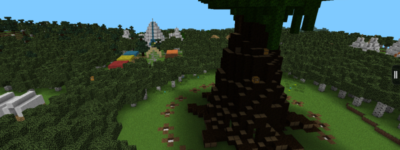
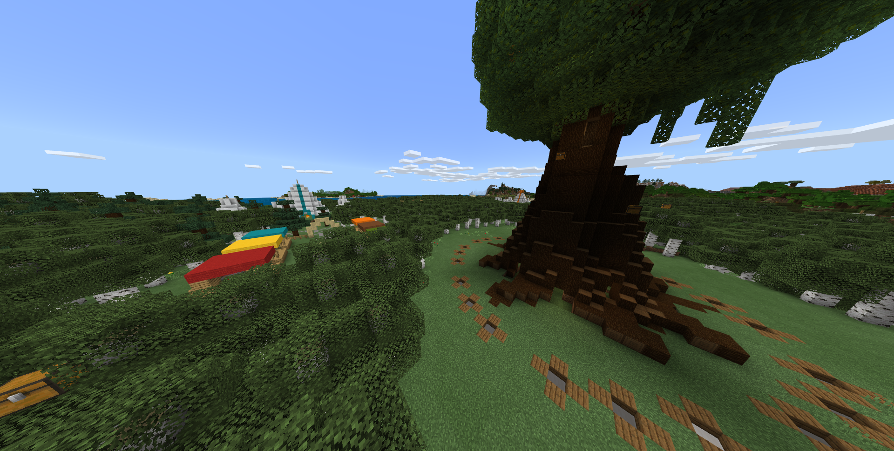

# pmf
A implementation for the legacy PocketMine chunk format, and built in methods to convert it to the latest mcworld format.

I really just speedran this in a day so I could convert the old Origins Survival Games map to the latest world format for use in Dragonfly, 
but someone else might find this useful.

This currently does not convert block entities, or tiles as PM calls them.

# Legacy PM image

# Updated Bedrock image
